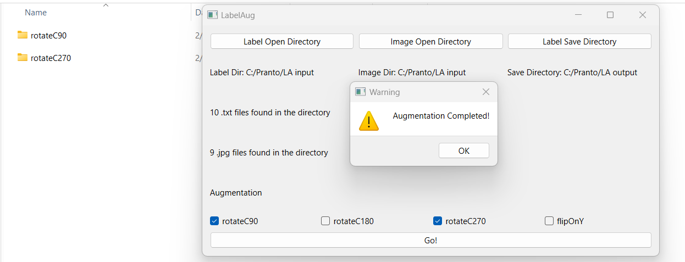

# About labelaug

labelaug is a simple python GUI app that is written in python and uses QT for graphical interface. It allows user to easily augment images and their corresponding labels in YOLO format. It offers multiple basic augmentation techniques which are most commonly used for data augmentation. It takes care of augmentation of multiple images and labels in a given directory without any sweat!

# Installation

Python 3.0 or above
Clone the repository

```bash

git clone https://github.com/Munimul/LabelAug.git

```

Change directory (cd) to the repository where it is cloned

```bash

cd LabelAug

```

Create a virtual Environment and acitvate it before installing dependencies(Optional)

Install Dependencies

```bash

pip install -r requirements.txt

```

Run the labelaug.py file

```bash

python labelaug.py

```

# Usage

Follow the steps above and run the labelaug.py file

    1. Select the directory using 'Label Open Directory' button where your label or yolo.txt files are located
    2. If the images are located in different folder, select that folder using 'Image Open Directory' button or select the same directory
    3. Select a folder where you want to save the augmented images and labels
    4. Select atleast one or multiple augmentation method
    5. Push 'Go' button
    6. For every augmentation, a subfolder will be created in your selected save directory. Images and label files will be located there.

### Picture sample




### Output image example
